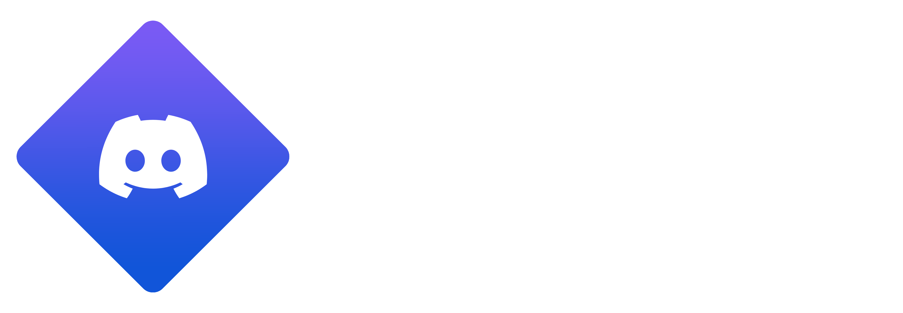
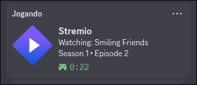

<div align="center">
  
  <h1>StremioRPC</h1>
  <p><em>Seamless integration of your Stremio with Discord Rich Presence</em></p>

  <!-- Badges -->
  <p>
    
    
    
    
    
  </p>
</div>

<br/>

## 📖 Description

**StremioRPC** is a project developed to connect Stremio to Discord, displaying what you are currently watching on your profile in real-time (Rich Presence).

The project architecture consists of two main parts:
1. **Stremio Addon:** A local addon built with `stremio-addon-sdk` that captures playback events and sends them to the local server.
2. **Local Server (Express + Discord RPC):** A fast Node.js backend that receives data from Stremio, consumes the OMDb API to fetch detailed media metadata, and updates your status on Discord.

All of this is orchestrated by an elegant shell script (`stremio_launcher.sh`) that starts the background processes and automatically terminates them when Stremio is closed.

---

## 📸 Demonstration



---

## 📑 Table of Contents

- [Technologies Used](#-technologies-used)
- [Prerequisites](#-prerequisites)
- [Installation](#-installation)
- [How to Run the Project](#-how-to-run-the-project)
- [Configuration](#-configuration)
- [Usage](#-usage)
- [Folder Structure](#-folder-structure)
- [Contributing](#-contributing)
- [License](#-license)
- [Contact](#-contact)

---

## 🛠 Technologies Used

- **[Node.js](https://nodejs.org/):** JavaScript runtime environment.
- **[Express.js](https://expressjs.com/):** Fast and minimalist web framework for Node.js.
- **[stremio-addon-sdk](https://github.com/Stremio/stremio-addon-sdk):** Official SDK for creating Stremio addons.
- **[discord-rpc](https://github.com/discordjs/RPC):** Library for interacting with local Discord Rich Presence.
- **[node-fetch](https://github.com/node-fetch/node-fetch):** HTTP client for requests to the OMDb API.
- **Bash / Shell Script:** For cross-platform automation via Linux.

---

## ⚙️ Prerequisites

Before you begin, ensure you have the following installed on your machine:

- **Node.js** (version 14+ recommended) and **npm** (included with Node)
- **Discord** running on the desktop (Discord RPC does not work on the web version)
- **Stremio** installed on your system (via native package or Flatpak)
- **Linux/Unix**-based Operating System (for the `stremio_launcher.sh`)

---

## 🚀 Installation

Follow the step-by-step guide below to run the project locally:

1. **Clone this repository:**
   ```bash
   git clone https://github.com/bryanrafaelbueno/StremioRPC.git
   cd StremioRPC
   ```

2. **Install the dependencies:**
   The project uses a single `package.json` for both applications.
   ```bash
   npm install
   ```

3. **Give execution permission to the Launcher:**
   To ensure the script can start everything:
   ```bash
   chmod +x stremio_launcher.sh
   ```

---

## 🔧 Configuration

Before running, you need to configure the API keys using environment variables:

1. Create a `.env` file in the `Server/` folder
2. **Discord Client ID:**  
   Add your application ID created in the [Discord Developer Portal](https://discord.com/developers/applications) to the `.env` file:
   ```env
   clientID="YOUR_CLIENT_ID_HERE"
   ```
3. **OMDb API Key:**  
   Add your [OMDb](http://www.omdbapi.com/) API key to fetch real movie/series names via IMDB ID.
   ```env
   OMDB_KEY="YOUR_API_KEY_HERE"
   ```

Example of the content in the `Server/.env` file:
```env
clientID="1446922291207344189"
OMDB_KEY="6ea6cda0"
```

---

## 🏃 How to Run the Project

To start the servers and open Stremio all at once, run the shell script:

```bash
./stremio_launcher.sh
```

### 👻 Running in the Background (Linux)

If you want to start Stremio with the RPC server but don't want to keep a terminal window open, you can run the script in the background and detach it:

```bash
nohup ./stremio_launcher.sh > /dev/null 2>&1 &
```
*Alternatively, you can create a `.desktop` entry to launch it directly from your application menu.*

### 🪈 Pipeline Overview

1. Validates if Node.js and the scripts exist.
2. Starts the **Local Addon** (`index.js`) on port `:7000`.
3. Starts the **RPC Server** (`Server/index.js`) on port `:41555`.
4. Opens the **Stremio** application.
5. Waits. Upon closing Stremio, it safely kills the Node background processes (`trap`).

---

## 🎮 Usage

1. After starting via the script, Stremio will open.
2. In Stremio, go to the Addons tab, find the search bar, and add the local addon URL:
   ```text
   http://localhost:7000/manifest.json
   ```
3. Install the "StremioRPC" addon.
4. Play any movie or series. The title, season, and time will be updated on your Discord!

---

## 📂 Folder Structure

```text
StremioRPC/
├── Server/                 # Express server code (Discord RPC + OMDb)
│   └── index.js            # IPC connection logic with Discord and API requests
├── index.js                # Main code for the Stremio Addon (Stremio SDK)
├── stremio_launcher.sh     # Unified bash script to start/stop the application
├── package.json            # Node.js manifest with dependencies
└── package-lock.json       # Exact version control of dependencies
```

---

## 🤝 Contributing

Contributions are always welcome! If you want to help improve the project, follow the steps below:

1. **Fork** the project
2. Create your Feature Branch (`git checkout -b feature/MyNewFeature`)
3. Commit your changes (`git commit -m 'Add: My new feature'`)
4. Push to the Branch (`git push origin feature/MyNewFeature`)
5. Open a **Pull Request**

---

## 📄 License

This project is licensed under the **MIT** License. See the `package.json` file for more details or add a `LICENSE` file to the repository.

---

## 📧 Contact / Author

**Bryan Rafael Bueno**  
- GitHub: [@bryanrafaelbueno](https://github.com/bryanrafaelbueno)

---
<div align="center">
  <sub>Made with ❤️ and Javascript.</sub>
</div>
